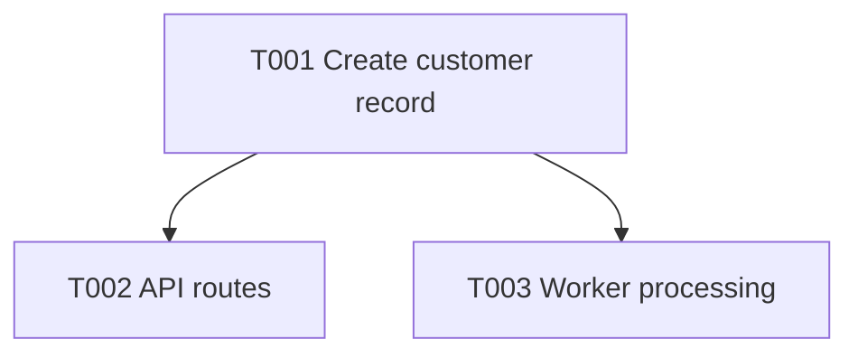

# Bootstrap Prerequisites

These steps must be complete before Dark Factory runs. They can be done by a
human or by an agent prompt, but they are outside T000 because Dark Factory needs
a real Git repository before it can create the T000 worktree.

## Step 1 — Planning Folder Ready

This file is the bridge between planning and the first business feature implementation.

Flow:

```text
bootstrap-manual-prerequisites.md -> bootstrap.md -> roadmap/tasks.md
```

`Planning/` defines the product shape, architecture choices, and roadmap context.

Expected planning shape:

```text
Planning/
  bootstrap-manual-prerequisites.md
  bootstrap.md
  context/
    business/
    technical/
  roadmap/
    tasks.md
    dependencies.mmd
```

`roadmap/tasks.md` is the task/status roadmap. It should have one `Task Graph`
table with one row per task, with status, priority, task id/title, size, branch,
dependencies, and context references. Use `S`, `M`, or `L` in the size column.

`Priority` is the orchestrator tie-breaker when multiple tasks are unblocked at
the same time. Lower numbers run and merge first among currently runnable tasks;
dependencies still decide what is blocked.

`roadmap/dependencies.mmd` is the Mermaid DAG for task dependencies. The
orchestrator should pick any unblocked task up to the configured
`maxConcurrency`; do not use execution waves or fixed wave merge order.

Example task row:

| Done | Priority | Task                            | Size | Branch                      | Depends On | Context                                                |
| ---- | -------- | ------------------------------- | ---- | --------------------------- | ---------- | ------------------------------------------------------ |
| [ ]  | 10       | `T001` - Create customer record | S    | `feat/t001-customer-record` | —          | `context/domain-model.md`, `context/api-boundaries.md` |

Example dependency graph:



- [ ] Create or confirm the planning folder exists with the required structure before running bootstrap.

## Step 2 — Manual GitHub Repository Settings

- [ ] Branch protection on `main` — GitHub UI → Settings → Branches → `main`:
  - Rule name: `Protect main`
  - Add target → Include default branch
  - Restrict deletions
  - Require a pull request before merging (0 approvals for solo)
  - Require conversation resolution before merging
  - Require status checks to pass for the checks that exist now: `Format`, `Lint`, `Type Check`, `Test`, `Build`
  - Block force pushes
- [ ] Auto-delete head branches — GitHub UI → Settings → General → Pull Requests → check "Automatically delete head branches"

## Step 3 — One-Time Developer-Machine Security Tooling

- [ ] Install [gitleaks](https://github.com/gitleaks/gitleaks/releases) on each dev machine.

## Step 4 — Repository Foundation

Purpose: create the repository boundary and publish the planning folder so Dark
Factory can safely create task worktrees.

> First commit message: `chore: initialize repository foundation`

- [ ] Initialize `/home/weights/Public/Projects/Inframodern/x` as its own Git repository.
- [ ] Add origin: `https://github.com/0-sayed/x.git`.
- [ ] Create `README.md` with project name, one-sentence description, and license.
- [ ] Create `.gitignore` and confirm `.env` is excluded.
- [ ] Create `LICENSE`.
- [ ] Create `.editorconfig`.
- [ ] Keep `Planning/` in the repository root.
- [ ] Create the first commit containing only repository foundation files and `Planning/`.
- [ ] Push `main` to origin.
- [ ] Confirm local `main` matches `origin/main`.
- [ ] Register the project with Dark Factory using `Planning/` as the planning folder.
- [ ] Run Dark Factory dry-run and confirm only `T000` is runnable.
